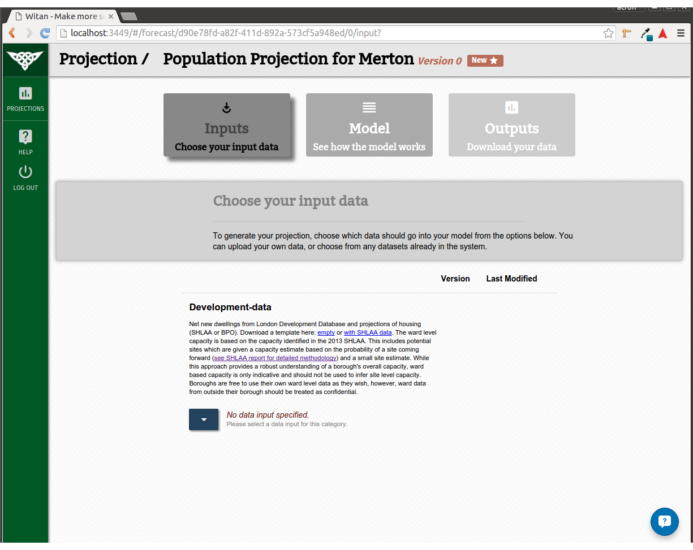
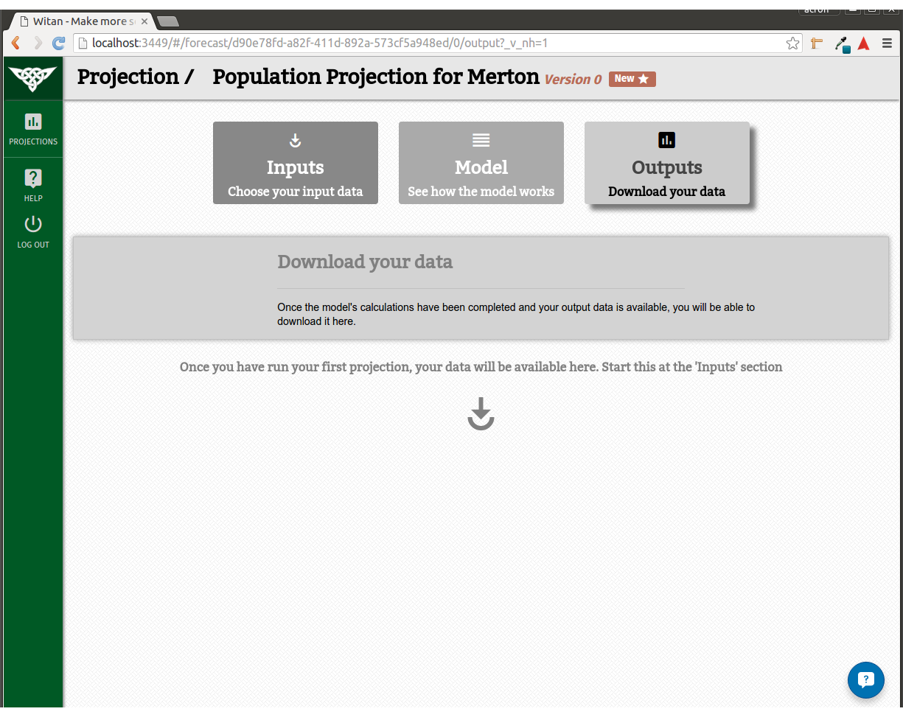
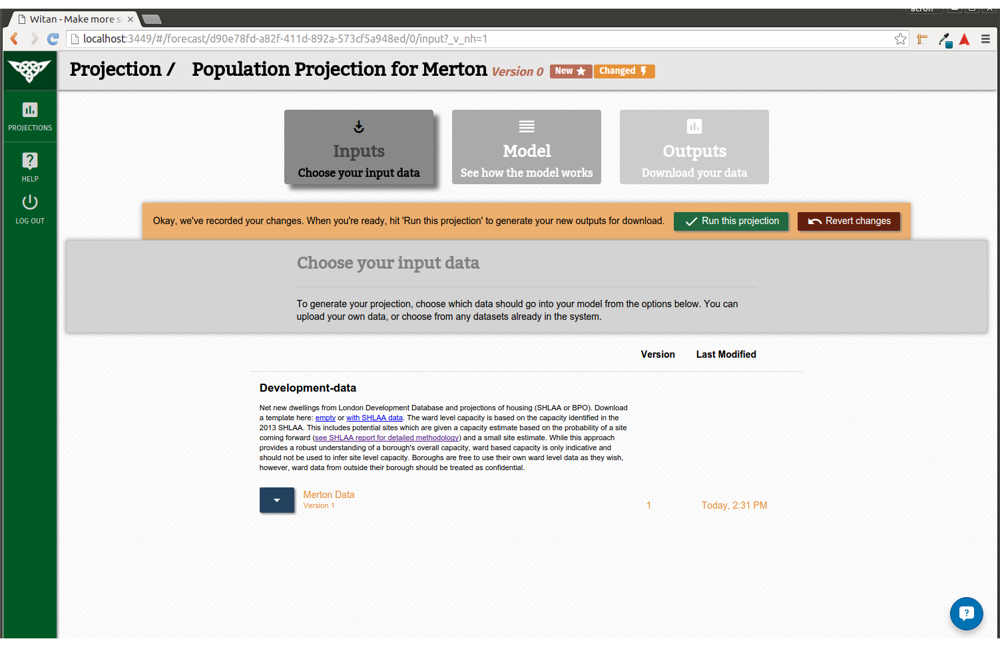
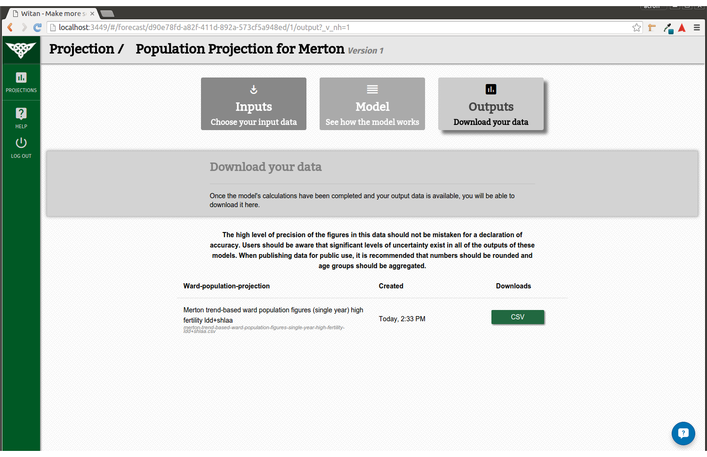

# User Guide for Witan
#### Current Version: MVP 1.1
Witan is a tool for planners and policy makers to help form a better understanding of the data that drives their city.

---------------------
***Please understand that Witan is currently in a state of development so there will be rough edges to the user experience, and the occasional glitch. If you encounter anything that seems different to how you would expect, or obviously buggy, please contact us by sending an email to [witan@mastodonc.com](mailto:witan@mastodonc.com), or using the in-app help feature.***

## Contents
* [Signing in](#signing-in)
* [Signing up](#signing-up)
* [Dashboard](#dashboard)
* [Creating a Projection](#creating-a-projection)
* [Projection View](#projection)
* [Running a Projection](#running-a-projection)
* [Getting Help](#getting-help)

## Signing in

Enter an email address and password and press 'Sign In'. In the case of a lost password, click the 'forgotten password' link. This will open the default email client with a prepopulated email message, which you can then send, or copy to send in an email program of your choice.

## Signing up
  
If you don't already have an account then you'll first need an invite code. These can be obtained by [emailing us](mailto:witan@mastodonc.com).

We're rolling out access in waves each week, so you may be need to wait a few days before you get you invite.

Once you do have an invite code, use the 'Create Account' button from the landing page to navigate to the correct screen. Enter your details (work email address, name and password) and create your account. You will be logged in immediately.

You will need to use the same email address the the invite was sent to - please contact us if you need to use a difference address.

## Dashboard

If this is your first time using the dashboard, you're likely to see an empty set of projections, somewhat like the screen below:


Once you've created your first few projections, it will look more like the screen below:


The Dashboard displays a list of all the accessible *Projections*.

Witan pivots around a core set of primitives which should be familiar to most people who've worked in city planning:

#### Data
Data is the foundation substance of Witan and can represent a vast array of different information, from statistics to sensor outputs. Data can enter the system in one of two ways:

* *Uploaded and used as an* ***Input*** *for a Projection*
* *Produced as an* ***Output*** *(result) *from a Projection*.
```html
Whilst in early development, Witan only accepts uploads in CSV format and Projections will only output CSVs.
```

#### Models
Models represent the transformation process under which Data is processed in the pursuit of a particular outcome. For example, given an *Input* of a city's population figures, a Model could manipulate those figures using particular assumption about migration to predict growth over the next 10 years. A different Model could use a different assumption, or could focus on an entirely different prediction altogether.  

#### Projections
In Witan we use the term 'Projection' as an umbrella term to refer to the combination of a Model, its configuration, a fixed set of Input Data and the resulting Output Data. We use this term because when thinking about a projection, in city planning terms, all of these parts are important to consider when evaluating the results.

## Creating a Projection
During a first encounter with the Dashboard it will likely be empty. To create a Projection, click on the green `+` button in the top-right corner. The following view will become available:
  

Fill in the details:
##### Name
A descriptive name for the Projections, e.g. Housing Projection for Camden
##### Description
An additional description for the Projection.
##### Model
The name and version of the Model to use.
##### Model Properties
Some Models have properties that require setting. For example, in the image, the 'Housing-linked Ward Population Projection Model' requires a London borough, a fertility assumption (High, Standard or Low) and a variant (DCLG or Capped Household Size) to be selected.

Once all the required inputs are filled, selecting the 'Create' will cause the application to load the newly created Projection.

## Projection
The Projection view has three parts to it which are navigated using the large gray buttons near the top of the page:

#### Inputs
  
The Inputs page displays a list of Input *Categories*, which are defined by the Model to describe a particular item of Data that the Model needs in order to run. Beneath the category description, the name of the currently configured Data item is displayed. Sometimes 'default' Data will be selected and other times, as in the image, the Model requires Data to be specified in order to run.

Clicking on the blue button will display the Data selection form for that category.


From here there are two options; either select an existing Data item from the items listed (and confirm with the 'Use' button), or *upload* a new Data item. It's also possible to download an existing Data item, for use as a template or reference, by selecting it and then using the 'Download' button.


To upload a file, use the 'Choose File' button and select the desired data source (must be a CSV file). Then choose to either give this data source a brand new name or to use an existing name (in which case the version number of the existing data source will be incremented). Clicking 'Upload' will begin the process.

#### Model
  
The Model page displays information about the selected model, including a list of the Model Properties that were chosen when the Projection was created.
```html
Once a Projection is created, Model Properties cannot be adjusted. This is temporary and eventually they will be configurable.
```

#### Outputs
  
The Outputs page displays a list of the results that were generated the last time the Model was run. If, as in the image, the Model has yet to be run - or if it's currently being run and is 'In Progress' - then a helpful message is displayed.

Once the Model has been run, each Output is listed and download buttons with the relevant file types are displayed (e.g. "CSV", "XLSX").

## Running a Projection
It's often the case that after creating a new Projection, Data items are required before it can be run. These are clearly indicated by the red lettering - "No data input specified" - beneath an Input Category description. Once all Input Categories have appropriate Data items selected *or* there has been a change - a different Data item has been selected since the last run - a new dialog will appear:

  

This presents two options; either to revert the changes that have been made to the Projection ("Revert changes") or to run the Projection ("Run this projection"). Selecting the latter will cause the Projection to 'lock in' all of the Data items and Model Properties and perform a full run of the Model with these settings. A new version of the Projection has now been created and the application will automatically update to display it.

  

Depending on the Model, it could take a few minutes to generate the Outputs. During this time the Projection will appear as "In Progress" and any further changes will be prevented until it has completed. Once the Outputs are ready the page should automatically update and items will now be available on the Outputs page.

  

Now the Outputs can be downloaded via the appropriate file-format buttons. Any subsequent changes to Data items, on the Inputs page, will cause a new version of the Projection and the Model to re-run.

## Getting Help
  
At any time you see this icon you can click it to open a live conversation with a Mastodonian. We'll be happy to answer any questions you might have, or just talk you through a particular process. If for some reason we're unavailable then we'll get back to you as soon as possible.

  
Via this window you can also enquire about more formal training sessions which we'll be happy to discuss with you and schedule.
