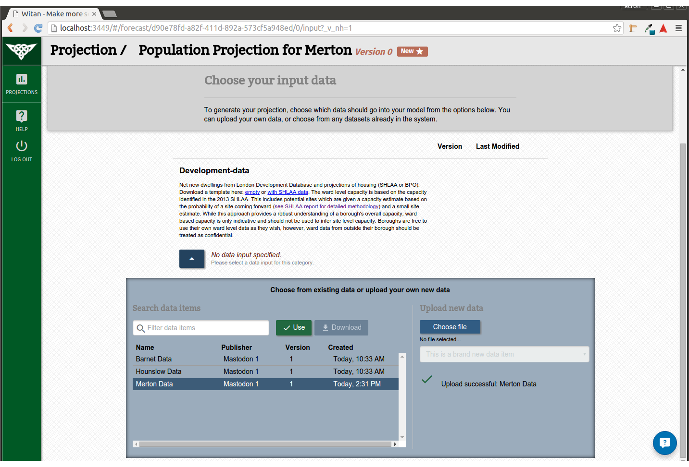

# User Guide for Witan
#### Current Version: MVP 1
Witan is a tool for planners and policy makers to help form a better understanding of the data that drives their city.

---------------------
## Prerequisites
* You require a login for Witan. Currently, the best way to obtain one is to [contact us](theteam@mastodonc.com) and we can facilitate, or alternatively, ask your manager.
* ***Please understand that Witan is currently in an ALPHA state and is prone to glitches and bugs. If you encounter such an event, please [contact us](theteam@mastodonc.com) and let us know what happened.***

## Signing in

Enter your email address and password and press 'Sign In'. If you've lost your password, click the 'forgotten password' link and it will allow you to send us an email message, asking for your password to be reset.

## Dashboard

After signing in you will see a dashboard which lists all of the *Projections* that you have access to.

Witan pivots around a core set of primitives which should be familiar to most people who've worked in city planning:

#### Data
Data is the foundation substance of Witan and can represent a vast array of different information, from statistics to sensor outputs. Data can enter the system in one of two ways: 
* *Uploaded and used as an **Input** for a Projection*
* *Produced as an **Output** (result) from a Projection*.
```html
ALPHA: We only accept uploads in CSV format and projections will only output CSVs.
```

#### Models
Models represent the transformation process under which Data is processed in the pursuit of a particular outcome. For example, given an *Input* of a city's population figures a Model could manipulate those figures using a particular assumption about migration, to predict growth over the next 10 years. A different Model could use a different assumption, or could focus on an entirely different prediction altogether.  

#### Projections
In Witan we use the term 'Projection' as an umbrella term to refer to the combination of a Model, it's configuration, a fixed set of Input Data and the resulting Output Data. We use this term because when thinking about a projection, in city planning terms, all of these parts are important to consider when evaluating the results. 

## Creating a Projection
It's likely that when you first encounter the Dashboard, it will be empty. To create a Projection, click on the green `+` button in the top-right corner. You should see the following screen:  
  

Fill in the details:
##### Name
A descriptive name for your Projections, e.g. Housing Projection for Camden
##### Description
An additional description for the Projection. You could include justifications or contact details.
##### Model
The name and version of the Model you want to use.
##### Model Properties
Some Models have properties that you need to set. For example, in the image, the 'DCLG-based Housing Linked Model' prompts you to select a London borough.

Once all the required inputs are filled, selecting the 'Create' but should take you to the page for your newly created Projection.

## Projection
The Projection view has three parts to it which are navigated using the large gray buttons near the top of the page:

#### Inputs
  
The Inputs page displays a list of Input *Categories*, which is defined by the Model to describe a particular item of Input Data that the Model needs in order to run. Sometimes 'default' Data will be selected and other times, as in the image, the Model requires Data to be specified in order to run.

Clicking on the blue button will display the Data selection form for that category.

 


